# Attendify

Attendify is a modern mobile application designed to simplify attendance management and class scheduling in educational institutions. The system enables students, teachers, and administrators to manage attendance and schedules efficiently through a secure and user-friendly platform.

---

# ✨ Features

## 👨‍🎓 Student Features
- Register and login with role-based access
- Scan QR codes for instant attendance marking
- Manual entry support for session codes
- View course-wise attendance reports
- View detailed attendance history
- Real-time attendance notifications and warnings

## 👨‍🏫 Teacher Features
- Secure teacher dashboard
- Generate unique 6-digit QR codes for attendance sessions
- Real-time monitoring of students joining the session
- share the session in web app by link 
- View and manage existing attendance records
- Access course schedules and student lists

## 🛠 Admin Features
- Comprehensive user management (Approve students, Create teachers)
- Manage departments and courses
- Create and assign class schedules
- Global attendance monitoring and reporting

---

# 🛠 Tech Stack

- **Language**: Kotlin
- **UI Framework**: Jetpack Compose (Modern Declarative UI)
- **Database**: Room (Local Persistence) & Firebase Firestore (Cloud Sync)
- **Auth**: Firebase Authentication
- **Architecture**: MVVM (Model-View-ViewModel)
- **Scanner**: Google ML Kit & CameraX

---

# 📱 Screenshots

<p align="center">
  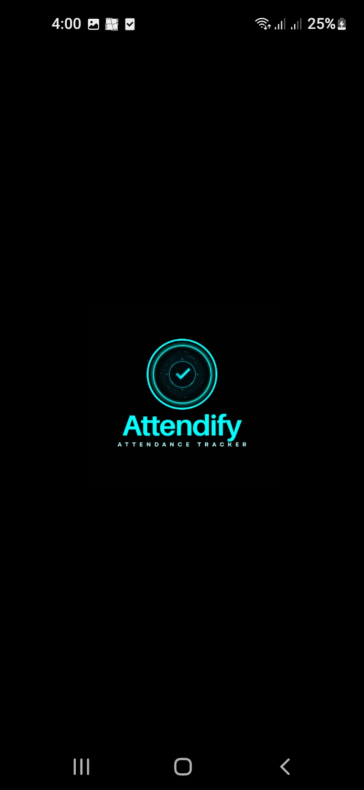
  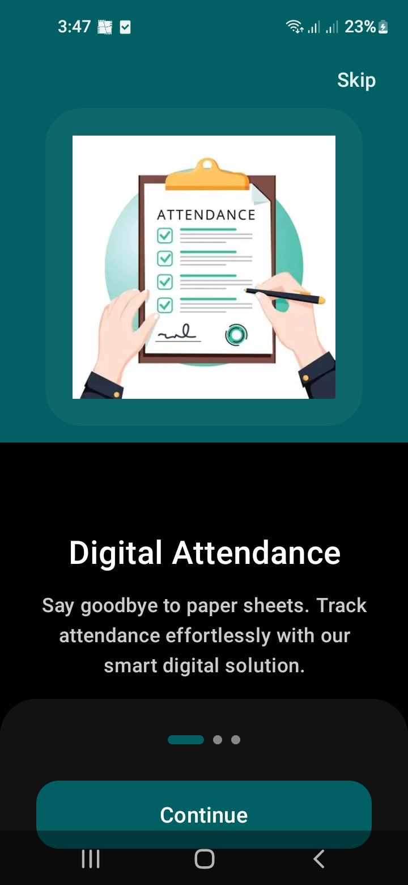
  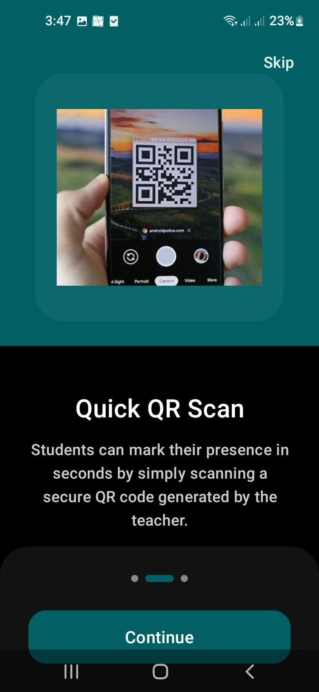
  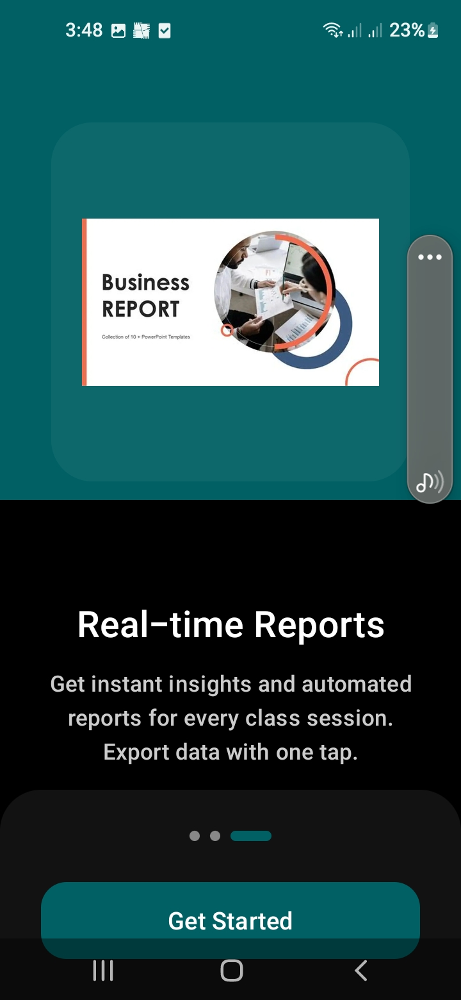
</p>
<p align="center">
  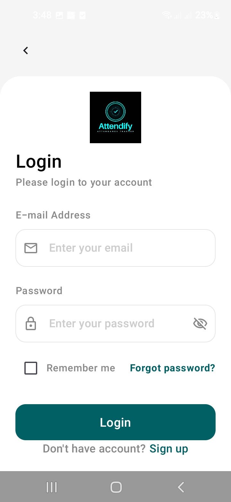
  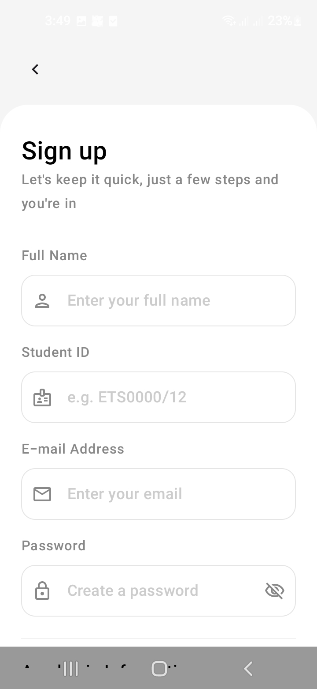
  
  
  
  
  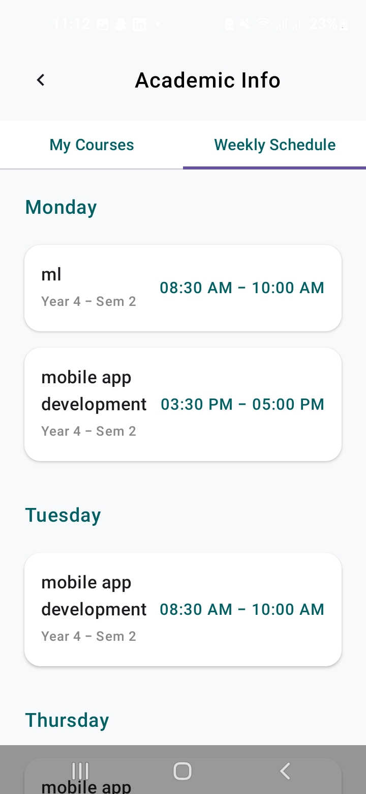
  
  
  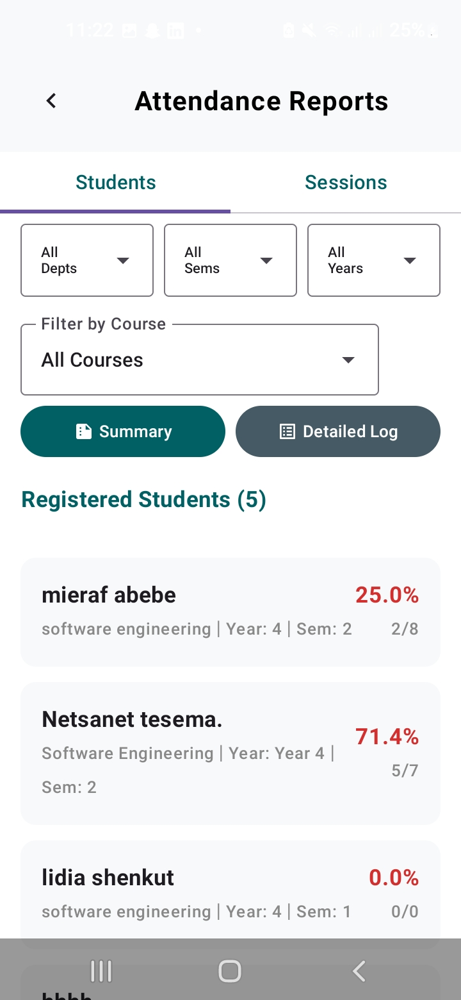
  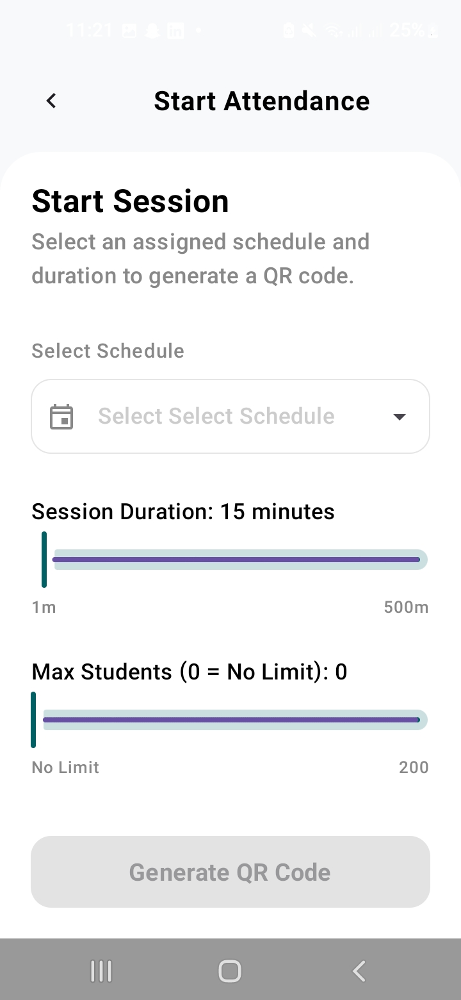
  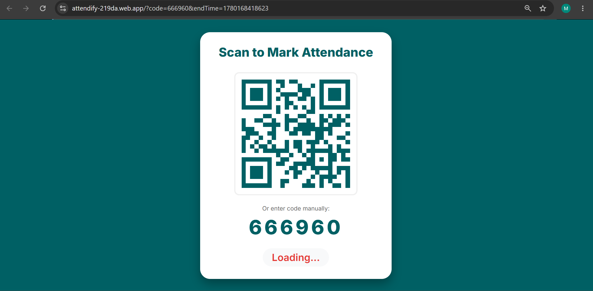
  
  
  
  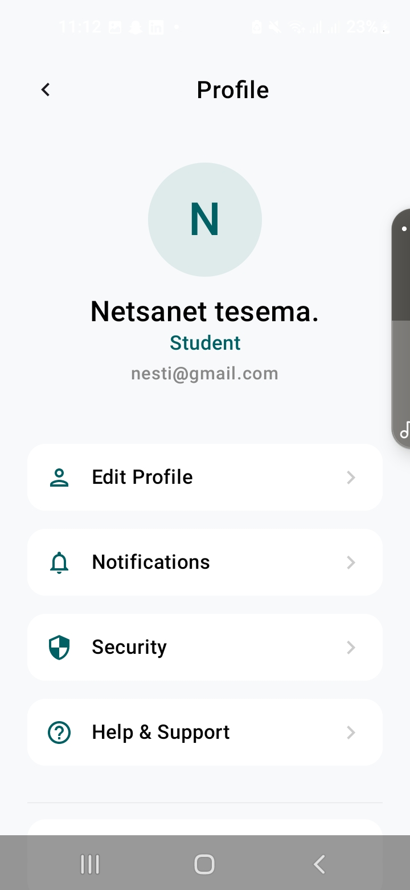
  
  
  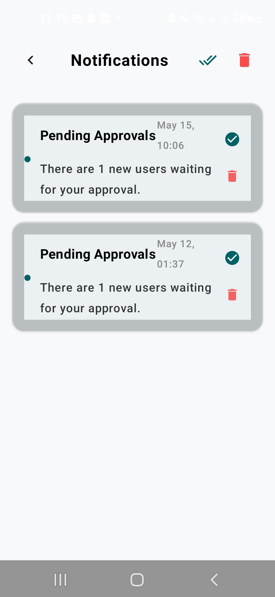
</p>


---

# 📂 Project Structure

```plaintext
app/
├── data/       # Local & Remote Data Sources, Repositories, Mappers
├── domain/     # Domain Models, Repository Interfaces
├── ui/         # UI Screens, ViewModels, Navigation, Theme
```

---

# 🔥 Firebase Setup

1. Create a Firebase project at [Firebase Console](https://console.firebase.google.com/).
2. Add an Android app using your package name.
3. Download `google-services.json` and place it in the `app/` directory.
4. Enable **Firebase Authentication** (Email/Password).
5. Enable **Cloud Firestore** and set up the required collections.

---

# 🚀 Installation

## Clone Repository
```bash
git clone https://github.com/MierafA12/university-attendance-App.git
```

## Open Project
Open the project folder in **Android Studio (Hedgehog or newer)**.

## Run the Application
1. Connect a physical device or start an emulator.
2. Click **Run** in Android Studio.

---

# 🔐 Security & Validation

* **Duplicate Prevention**: Students cannot mark attendance twice for the same session.
* **Role-Based Access**: Secure routing based on user roles (Admin, Teacher, Student).
* **Account Approval**: Students require Admin approval before they can scan.

---

# 📄 License

This project is developed for educational purposes.
